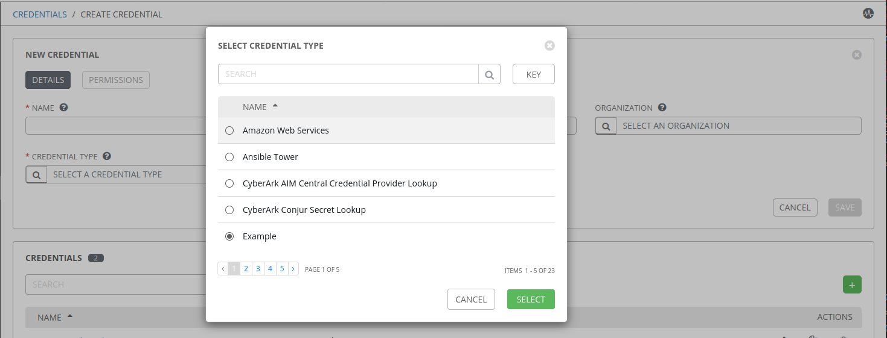

AWX Credential Plugin Example
=================================

This is an example credential plugin for [AWX](https://github.com/ansible/awx/). For more details, see the development documentation for [credential plugins](https://github.com/ansible/awx/blob/devel/docs/credentials/credential_plugins.md).

### Installation
Installing credential plugins in this way is an advanced feature for admin users who wish to customize their installation. **It is critically important that you create a backup of your system** and verify that you can restore your system from that backup before proceding any further.

1. Backup your system and be prepared to restore.
2. Install the plugin to your awx virtualenv. The precise location of this virtualenv varies based on deployment, so consult the product or project documentation.
```shell
source /venv/awx/bin/activate
pip install git+https://github.com/jakemcdermott/example-credential-plugin.git
```
3. Activate the plugin
```shell
awx-manage shell -c "from awx.main.models import CredentialType; CredentialType.setup_tower_managed_defaults()"
```

### Usage
After installing the credential plugin, it will be loaded automatically by the web interface.



 See product documentation for more information on usage.
